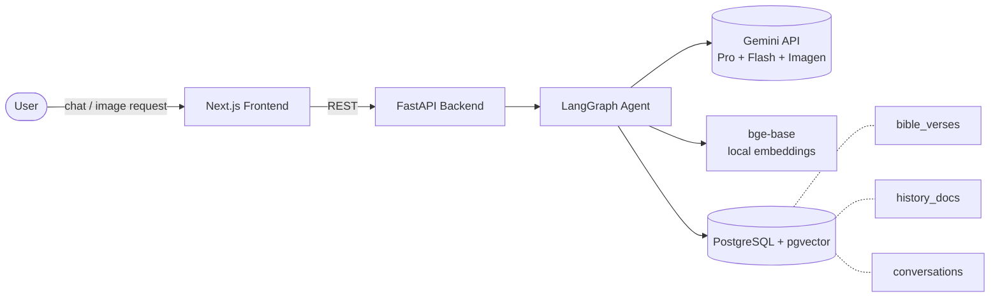
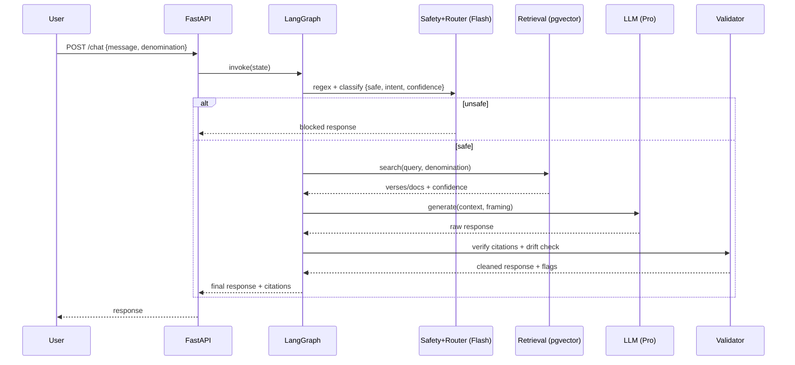
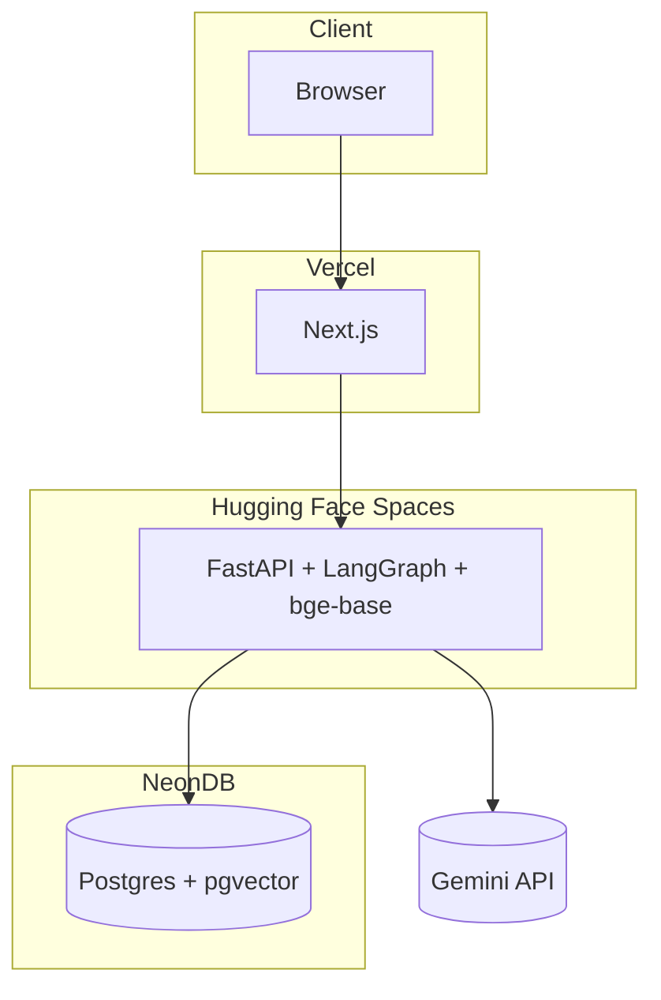

# High-Level Design (HLD)

**System:** Christianity-Focused AI Assistant
**Audience:** technical reviewers, contributors
**Companion docs:** [`ARCHITECTURE.md`](./ARCHITECTURE.md) (detailed design), [`SYSTEM_DESIGN.md`](./SYSTEM_DESIGN.md) (full SDD), [`PHASES.md`](./PHASES.md) (build plan)

---

## 1. Purpose

A grounded, denomination-aware assistant that answers Christianity questions,
generates Christian content and images, cites scripture from a verified corpus,
and refuses unsafe or adversarial requests. The defining constraint: **never
assert scripture or historical fact from model memory** — only from retrieval.

---

## 2. System Context

External dependencies: Gemini API (generation, safety classification, image),
local bge-base embedding model (HF), PostgreSQL + pgvector.

---

## 3. Component Overview

| Component | Responsibility | Tech |
| :-- | :-- | :-- |
| Frontend | Chat UI, denomination selector, citation + image rendering | Next.js + Tailwind |
| Backend API | HTTP, sessions, request-id logging, graph invocation | FastAPI |
| Agent | Orchestrates safety → routing → retrieval → validation → response | LangGraph |
| Retrieval | Denomination-aware scripture/history search, citation lookup | psycopg3 + pgvector |
| Embeddings | Query + corpus vectors (corpus precomputed offline) | sentence-transformers (bge-base) |
| LLM | Grounded generation + theological reasoning | Gemini 2.5 Pro |
| Safety/Router | Moderation + intent classification (single call) | Gemini 2.5 Flash |
| Image | Prompt rewrite + generation + re-validation | Imagen 3 |
| Data | Vectors + relational storage | PostgreSQL + pgvector |

---

## 4. Request Flow (text)

---

## 5. Data Flow — Grounding

1. **Offline:** corpus text → bge-base embeddings → pgvector (`bible_verses`, `history_docs`).
2. **Query time:** user query → bge-base (with retrieval instruction) → cosine search filtered by canon.
3. **Generation:** retrieved context injected into prompt; model cites only what it sees.
4. **Validation:** citations regex-checked against corpus; response embedding drift-checked vs retrieved set.

---

## 6. Safety Layers (defense in depth)

| Layer | Where | Catches |
| :-- | :-- | :-- |
| Regex | pre-routing | obvious adversarial templates, explicit hate |
| Flash classifier | pre-routing | subtle manipulation, evasion, misuse |
| Retrieval-first prompt | generation | fabricated scripture |
| Citation validator | post-generation | fake `Book Ch:Verse` references |
| Semantic drift check | post-generation | paraphrase hallucination |
| History grounding / abstain | retrieval | fabricated historical claims |
| Image two-pass moderation | image path | unsafe raw + post-rewrite prompts |

---

## 7. Deployment Topology

---

## 8. Key Design Decisions

- **Single Postgres + pgvector** for vectors + relational — corpus is small; avoids service sprawl.
- **Local embeddings (bge-base)** — free, deterministic, no per-call cost for bulk corpus embedding.
- **Safety as graph nodes**, not prompt-only — enforceable and testable.
- **Denomination as first-class state** — drives canon filter, retrieval scope, framing.
- **Two grounding corpora** — scripture and history are distinct retrieval sources; non-scripture facts never answered from memory.

See [`ARCHITECTURE.md`](./ARCHITECTURE.md) §7–12 for rationale and trade-offs.
