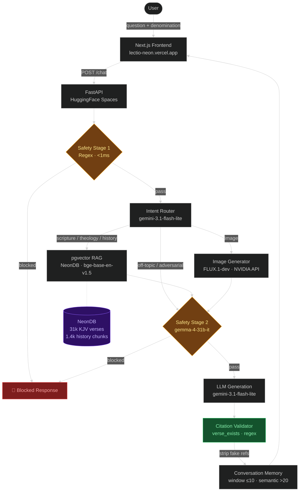

```mermaid
%%{init: {'theme': 'dark'}}%%
flowchart TD
    U([User]) -->|question + denomination| FE[Next.js Frontend\nlectio-neon.vercel.app]
    FE -->|POST /chat| API[FastAPI\nHuggingFace Spaces]

    API --> S1{Safety Stage 1\nRegex · <1ms}
    S1 -->|blocked| BLK[🚫 Blocked Response]
    S1 -->|pass| IR[Intent Router\ngemini-3.1-flash-lite]

    IR -->|scripture / theology / history| RAG[pgvector RAG\nNeonDB · bge-base-en-v1.5]
    IR -->|image| IMG[Image Generator\nFLUX.1-dev · NVIDIA API]
    IR -->|off-topic / adversarial| S2

    RAG --> S2{Safety Stage 2\ngemma-4-31b-it}
    S2 -->|blocked| BLK
    S2 -->|pass| GEN[LLM Generation\ngemini-3.1-flash-lite]

    GEN --> CV[Citation Validator\nverse_exists · regex]
    CV -->|strip fake refs| MEM[Conversation Memory\nwindow ≤10 · semantic >20]
    MEM --> FE

    IMG --> S2

    RAG -.- DB[(NeonDB\n31k KJV verses\n1.4k history chunks)]

    style BLK fill:#7f1d1d,stroke:#ef4444,color:#fca5a5
    style S1 fill:#713f12,stroke:#f59e0b,color:#fde68a
    style S2 fill:#713f12,stroke:#f59e0b,color:#fde68a
    style CV fill:#14532d,stroke:#22c55e,color:#86efac
    style DB fill:#2e1065,stroke:#8b5cf6,color:#c4b5fd
```
